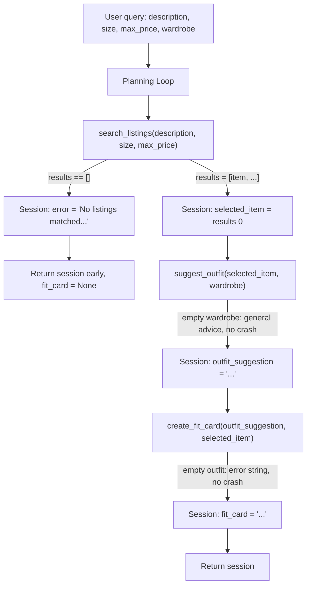

# FitFindr — planning.md

> Complete this document before writing any implementation code.
> Your spec and agent diagram are what you'll use to direct AI tools (Claude, Copilot, etc.) to generate your implementation — the more specific they are, the more useful the generated code will be.
> Your planning.md will be reviewed as part of your submission.
> Update it before starting any stretch features.

---

## Tools

List every tool your agent will use. For each tool, fill in all four fields.
You must have at least 3 tools. The three required tools are listed — add any additional tools below them.

### Tool 1: search_listings

**What it does:**
<!-- Describe what this tool does in 1–2 sentences -->
Searches the dataset for items matching the user's description, optionally filtered by size, and priced at or below max_price. Returns the matches sorted by relevance.
**Input parameters:**
<!-- List each parameter, its type, and what it represents -->
- `description` (str): keywords describing the item the user wants, e.g. "vintage graphic tee". Matched against each listing's title, description, and style_tags.
- `size` (str):  the size to filter to, e.g. "M". If None, the size filter is skipped and listings of any size are eligible.
- `max_price` (float): the highest acceptable price. 

**What it returns:**
<!-- Describe the return value — what fields does a result contain? -->
A list of dicts sorted by relevance. Each dict contains the full set of fields from listings.json: id, title, description, category, style_tags, size, condition, price, colors, brand, and platform. 
**What happens if it fails or returns nothing:**
<!-- What should the agent do if no listings match? -->
Returns an empty list []. The agent detects the empty list, tells the user no listings matched and suggests broadening the search,and stops without calling suggest_outfit.
---

### Tool 2: suggest_outfit

**What it does:**
<!-- Describe what this tool does in 1–2 sentences -->
Given a specific clothing item and the user's current wardrobe, asks the LLM to suggest a complete outfit combination that pair the new item with pieces the user already owns.
**Input parameters:**
<!-- List each parameter, its type, and what it represents -->
- `new_item` (dict): a single listing dict (the item the user is considering), as returned by search_listings — contains fields like title, category, colors, and style_tags that the LLM uses to build the suggestion.
- `wardrobe` (dict): the user's wardrobe, following the structure in wardrobe_schema.json. Contains an items list, where each item describes a piece the user already owns.

**What it returns:**
<!-- Describe the return value -->
A string describing an combination — e.g. "Pair this with your wide-leg jeans and platform Docs for a 90s grunge look." 
**What happens if it fails or returns nothing:**
<!-- What should the agent do if the wardrobe is empty or no outfit can be suggested? -->
If the wardrobe is empty (no items), the tool does not crash — instead it asks the LLM for general styling advice for the new item on its own, rather than referencing specific owned pieces. If the LLM call itself fails, the tool returns a short fallback string rather than raising an exception, so the agent can still continue.
---

### Tool 3: create_fit_card

**What it does:**
<!-- Describe what this tool does in 1–2 sentences -->
Given a complete outfit suggestion and the new item, asks the LLM to generate a short, shareable caption — the kind of thing someone would post with an outfit photo on Instagram or Depop. 
**Input parameters:**
<!-- List each parameter, its type, and what it represents -->
- `outfit` (str): the outfit suggestion string returned by suggest_outfit — describes how the new item is styled with other pieces.
- `new_item` (dict): the listing dict for the new item, used so the caption can reference specifics like the title, price, or platform it was thrifted from.
**What it returns:**
<!-- Describe the return value -->
A string (one or two sentences, casual and caption-style) — e.g. "thrifted this faded band tee off depop for $22 and it was made for my wide-legs 🖤". A single string the agent stores as the final output.
**What happens if it fails or returns nothing:**
<!-- What should the agent do if the outfit data is incomplete? -->
If the outfit string is empty or missing, the tool does not call the LLM — it returns a short, descriptive error-message string (e.g. "Can't make a fit card without an outfit suggestion.") rather than raising an exception. If the LLM call itself fails, it returns a fallback string so the agent doesn't crash.
---

### Additional Tools (if any)

<!-- Copy the block above for any tools beyond the required three -->

---

## Planning Loop

**How does your agent decide which tool to call next?**
<!-- Describe the logic your planning loop uses. What does it look at? What conditions change its behavior? How does it know when it's done? -->
The agent runs a fixed sequence of steps, but each step is gated by a condition that checks what the previous tool returned — so the agent stops or changes course based on results rather than blindly calling all three tools. Call search_listings with the user's description, size, and max_price. Check the returned list: If it's empty, store an error message in session["error"], leave session["fit_card"] as None, and return early. suggest_outfit and create_fit_card are never called. If it has results, store the top result as session["selected_item"] = results[0] and continue. Call suggest_outfit with session["selected_item"] and the user's wardrobe. Store the returned string as session["outfit_suggestion"]. If the wardrobe is empty, suggest_outfit still returns general styling advice (handled inside the tool), so the agent continues normally. Call create_fit_card with session["outfit_suggestion"] and session["selected_item"]. Store the result as session["fit_card"]. If the outfit suggestion is empty, create_fit_card returns an error string (handled inside the tool) rather than crashing. Return the session dict. The agent is "done" when it has either set session["error"] (early exit) or filled session["fit_card"]. The key conditional is at step 1: the empty-results branch terminates the flow before any LLM tools run. This is what makes the loop responsive to results rather than a fixed pipeline.
---

## State Management

**How does information from one tool get passed to the next?**
<!-- Describe how your agent stores and accesses state within a session. What data is tracked? How is it passed between tool calls? -->
The agent keeps a single session dictionary for the duration of one query. Each tool's output is written into the session under a named key, and later tools read their inputs from that same session — so nothing has to be re-entered by the user or re-derived between steps. Data flows one direction: search_listings → selected_item → suggest_outfit → outfit_suggestion → create_fit_card → fit_card. Because everything lives in one dict passed through run_agent(), the exact item found in step 1 is the exact item styled in step 2 and captioned in step 3 — no copies, no re-entry.
---

## Error Handling

For each tool, describe the specific failure mode you're handling and what the agent does in response.

| Tool | Failure mode | Agent response |
|------|-------------|----------------|
| search_listings | No results match the query | Stores an error message in session["error"] and stops before calling any other tool. Tells the user no listings matched and suggests broadening the search — raising max_price, removing the size filter, or using simpler keywords. fit_card stays None. |
| suggest_outfit | Wardrobe is empty | Does not crash. Falls back to asking the LLM for general styling advice for the new item on its own (what it pairs well with broadly), instead of referencing specific owned pieces. The agent continues to create_fit_card normally. |
| create_fit_card | Outfit input is missing or incomplete | Skips the LLM call and returns a short descriptive error string (e.g. "Can't make a fit card without an outfit suggestion") instead of raising an exception. The agent still returns a session the user can read. |

---

## Architecture

<!-- Draw a diagram of your agent showing how the components connect:
     User input → Planning Loop → Tools (search_listings, suggest_outfit, create_fit_card)
                                                                          ↕
                                                                   State / Session
     Show what triggers each tool, how state flows between them, and where error paths branch off.
     ASCII art, a Mermaid diagram (https://mermaid.js.org/syntax/flowchart.html), or an embedded
     sketch are all fine. You'll share this diagram with an AI tool when asking it to implement
     the planning loop and each individual tool. -->

---

## AI Tool Plan

<!-- For each part of the implementation below, describe:
     - Which AI tool you plan to use (Claude, Copilot, ChatGPT, etc.)
     - What you'll give it as input (which sections of this planning.md, your agent diagram)
     - What you expect it to produce
     - How you'll verify the output matches your spec before moving on

     "I'll use AI to help me code" is not a plan.
     "I'll give Claude my Tool 1 spec (inputs, return value, failure mode) and ask it to implement
     search_listings() using load_listings() from the data loader — then test it against 3 queries
     before trusting it" is a plan. -->

**Milestone 3 — Individual tool implementations:**
I'll use Claude, one tool at a time. For each, I'll paste that tool's block from this planning.md (inputs, return value, failure mode) and ask Claude to implement it in tools.py.

search_listings: must use load_listings(), filter by all three params, skip size when None, use price <= max_price, return [] on no match. Verify with a normal query, an impossible one (expect []), and a price-filter check.

suggest_outfit: Groq llama-3.3-70b call reading the key from .env. Verify it handles an empty wardrobe (general advice, no crash) and returns a string. Test with both example and empty wardrobes.

create_fit_card: high-temperature Groq call. Verify it guards an empty outfit string, then run 3 times on the same input to confirm captions differ.

**Milestone 4 — Planning loop and state management:**
I'll give Claude the Architecture diagram plus the Planning Loop and State Management sections, and ask it to implement run_agent() in agent.py. 
---

## A Complete Interaction (Step by Step)

Write out what a full user interaction looks like from start to finish — tool call by tool call. Use a specific example query.

**Example user query:** "I'm looking for a vintage graphic tee under $30. I mostly wear baggy jeans and chunky sneakers. What's out there and how would I style it?"

**Step 1:**
<!-- What does the agent do first? Which tool is called? With what input? -->
The agent calls the search_listings() tool. With inputs of "vintage graphic tee" and 30 (size is not given so it skips the filtering). This tool will then return 3 matching listings sorted by relevance and picks the top result. For example: "Faded Sun Tee — $24, Depop, Good condition."
**Step 2:**
<!-- What happens next? What was returned from step 1? What tool is called now? -->
The agent precedes to call the suggest_outfit() tool. This gives a pairing on the new_item=<> and the user's wardrobe=<>.
**Step 3:**
<!-- Continue until the full interaction is complete -->
The agent then preces to call the create_fit_card() tool. With inputs being the new item found in step 1 and the suggestion given in step 2. This returns a statement. 
**Final output to user:**
<!-- What does the user actually see at the end? -->
The user sees the listing details, the outfit suggestion, and the fit card caption — all in one response. If `search_listings` returns no results, the agent tells the user to try a broader search, and stops — it does not call `suggest_outfit` with empty input.